# Direction B editorial redesign: evidence

*2026-08-27T00:39:47Z by Showboat 0.6.1*
<!-- showboat-id: 22d9eb75-ee43-42c0-bdc1-2748aaf6b330 -->

The captain approved Direction B, an editorial studio look: warm paper, ink, one restrained burnt-orange accent, Instrument Serif headings on Inter body, built against the 1440px and 390px reference artboards.

Every screenshot below is a real Chrome render of the static export that Cloudflare Pages serves — `out/`, built by `next build` — at a real viewport size, not a dev server and not a mock.

## The home page

The old home page opened on a 160px logo, a "Boutique Focus • Enterprise Capabilities" badge and "AI Solutions Built for Scale", then ran eight generic sections. Direction B opens on the positioning itself and puts the proof beside it.

```bash {image}
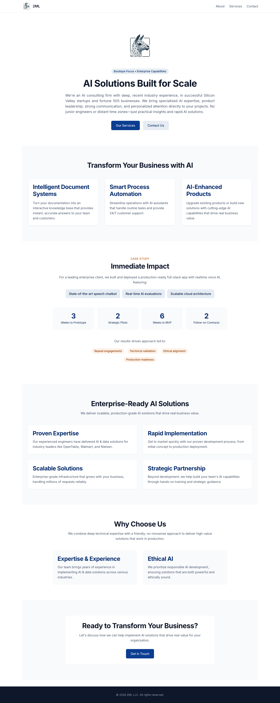
```


```bash {image}

```

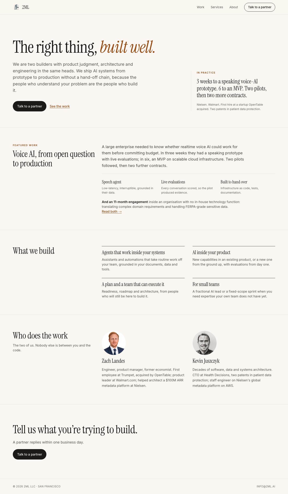

At 390px the same page keeps the artboard's order and its inset rule above the proof column.

```bash {image}

```


```bash {image}

```

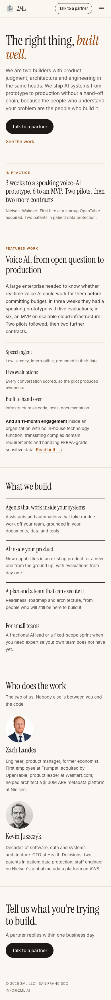

## The Work surface

`/work` is new and carries the approved anonymised evidence only: the voice-AI engagement in full, and the 11-month engagement described without naming the client. The four figures are the ones already on the site — 3 weeks to prototype, 6 to MVP, 2 pilots, 2 follow-on contracts — not new ones.

```bash {image}

```

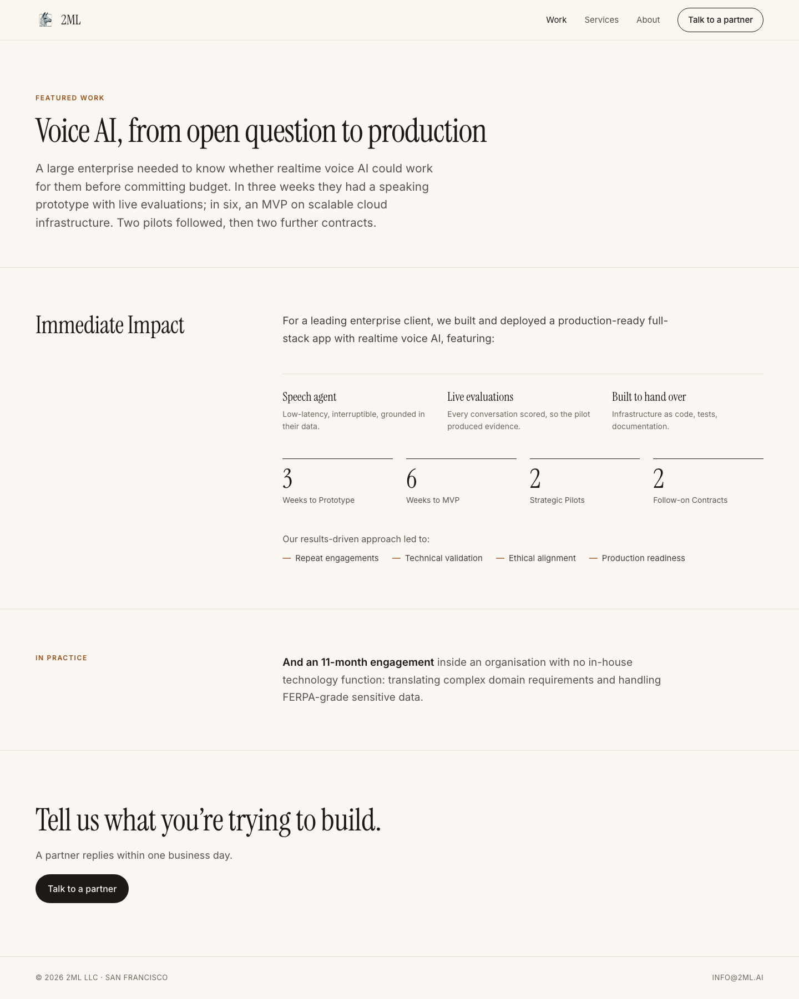

```bash {image}

```


## Services, About, Contact

Services drops the generic four-step process and leads with the four things we actually build, with "For small teams" named as its own path. About drops Mission / Approach / Values and keeps the real founder biographies. Contact keeps the Formspree form and now shows the right address.

```bash {image}

```

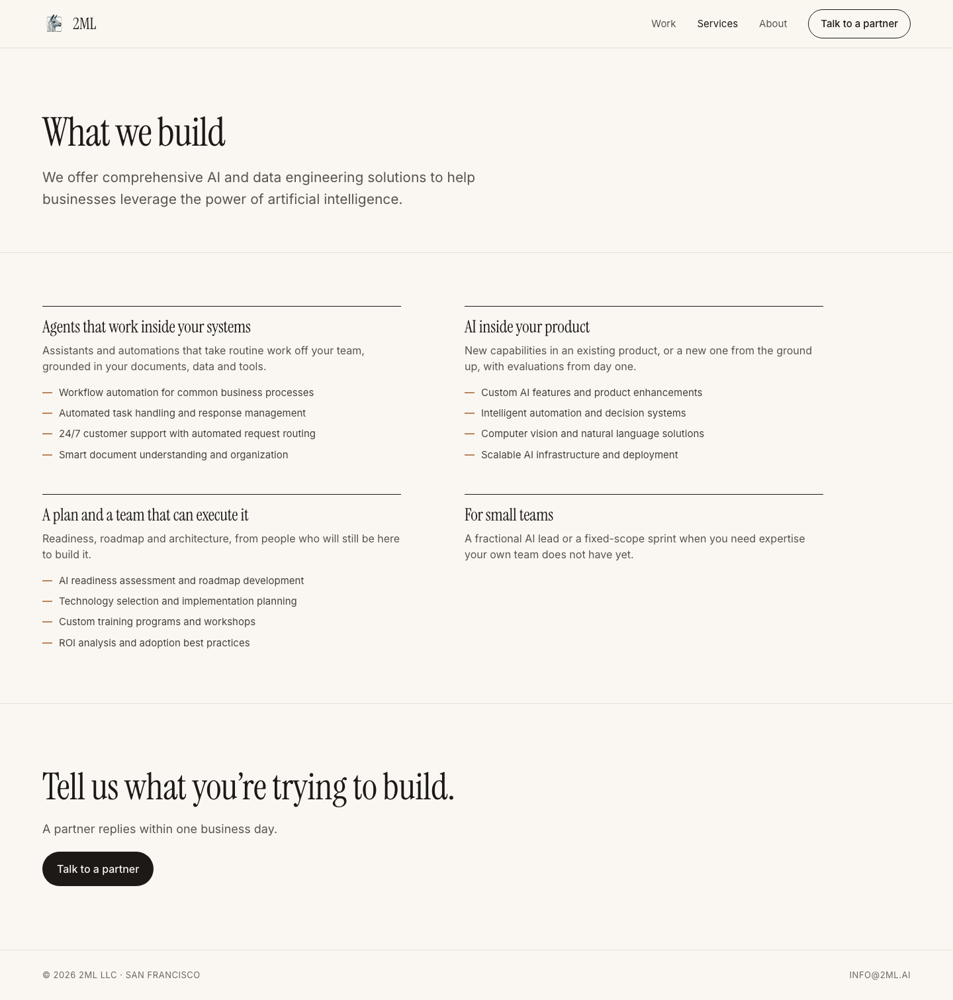

```bash {image}
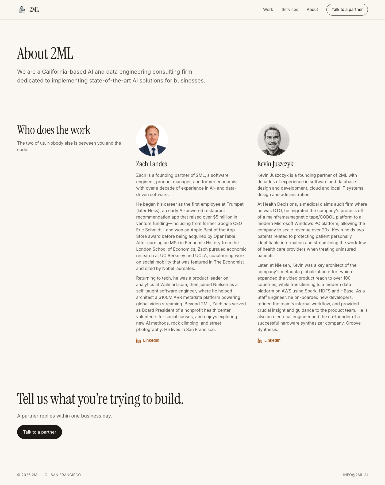
```


```bash {image}

```

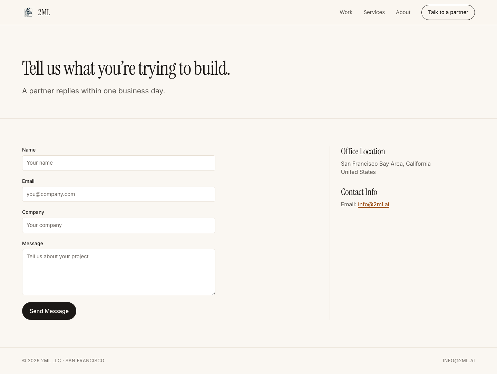

```bash {image}

```

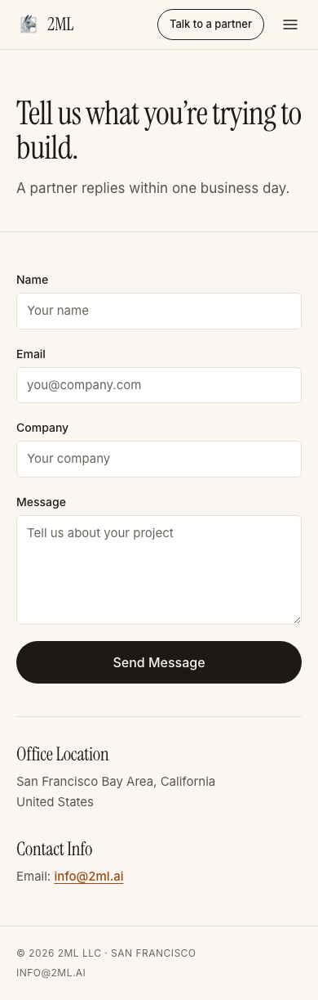

## Navigation and narrow phones

The nav carries Work · Services · About plus a persistent "Talk to a partner" button. The mobile toggle now reports its own state, owns the panel it controls, and Escape closes it and hands focus back.

```bash {image}

```

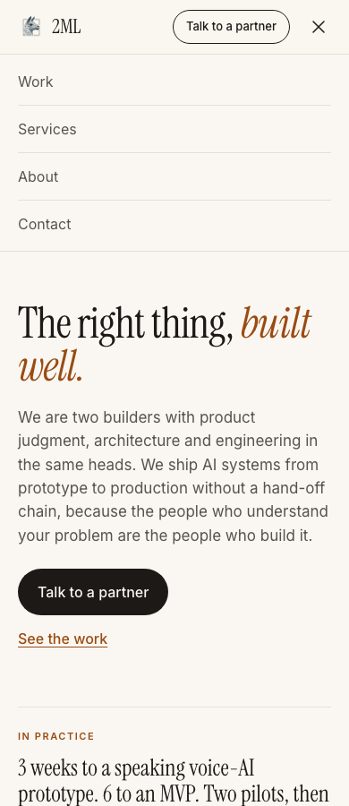

Below about 360px the pill and the toggle no longer fit beside the wordmark, so the pill steps aside and the CTA lives in the panel. At 280px — the folded Galaxy Fold, the narrowest viewport in circulation — the page still does not scroll sideways.

```bash {image}

```

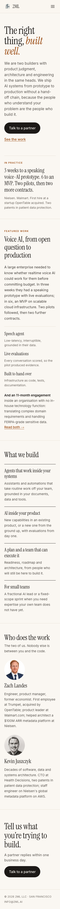

```bash
grep -n 'aria-expanded\|aria-controls\|aria-current\|aria-label' src/components/Navigation.tsx
```

```output
58:              aria-current={pathname === item.path ? 'page' : undefined}
82:            aria-label="Menu"
83:            aria-expanded={isMenuOpen}
84:            aria-controls="mobile-nav"
114:              aria-current={pathname === item.path ? 'page' : undefined}
```

## What was deleted

The approved removals are gone from the tree rather than left beside the new design: the `/case-studies` placeholder route, the placeholder testimonials, Why Choose Us, Mission / Approach / Values, the oversized hero logo, the generic four-step process, and the unused create-next-app SVGs.

```bash
git diff --stat --diff-filter=D f4c75dd -- src public | cat
```

```output
 public/file.svg                              |   1 -
 public/globe.svg                             |   1 -
 public/next.svg                              |   1 -
 public/vercel.svg                            |   1 -
 public/window.svg                            |   1 -
 src/app/case-studies/page.tsx                | 108 ---------------------------
 src/components/Testimonials.tsx              |  42 -----------
 src/components/sections/AICapabilities.tsx   |  40 ----------
 src/components/sections/CTASection.tsx       |  28 -------
 src/components/sections/CaseStudySection.tsx |  73 ------------------
 src/components/sections/HeroSection.tsx      |  50 -------------
 src/components/sections/SectionWrapper.tsx   |  30 --------
 src/components/sections/ServicesOverview.tsx |  48 ------------
 src/components/sections/TeamApproach.tsx     |  39 ----------
 src/components/sections/WhyChooseUs.tsx      |  36 ---------
 src/types/section.ts                         |   5 --
 16 files changed, 504 deletions(-)
```

## The OpenTable fact

Trumpet was acquired by OpenTable; Zach did not work at OpenTable. The old `ServicesOverview` claimed we had "delivered AI & data solutions for industry leaders like OpenTable, Walmart, and Nielsen" — that component is gone, and every surviving mention frames OpenTable as the acquirer.

```bash
grep -rn 'OpenTable' src/ | cut -c1-150
```

```output
src/app/about/page.tsx:19:      'He began his career as the first employee at Trumpet (later Ness), an early AI-powered restaurant recommendation app
src/components/sections/Hero.tsx:31:          Nielsen. Walmart. First hire at a startup OpenTable acquired. Two patents in patient data
src/components/sections/WhoDoesTheWork.tsx:7:    bio: 'Engineer, product manager, former economist. First employee at Trumpet, acquired by OpenTable;
```

## Metadata and the Open Graph card

Every retained route carries its own title and description, and the site ships a real Open Graph image built from approved wording and brand facts.

```bash
grep -h -o '<title>[^<]*</title>' out/index.html out/work.html out/services.html out/about.html out/contact.html; grep -o 'og:image"[^>]*content="[^"]*"' out/index.html | head -1
```

```output
<title>2ML | The right thing, built well.</title>
<title>Work | 2ML</title>
<title>Services | 2ML</title>
<title>About | 2ML</title>
<title>Contact | 2ML</title>
og:image" content="https://2ml.ai/images/og.png"
```

```bash {image}
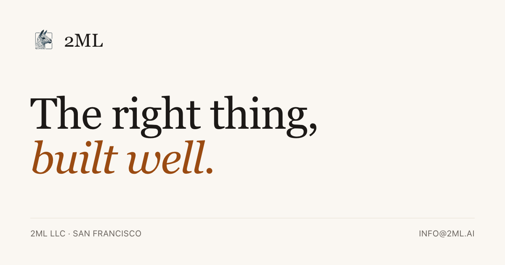
```


## Checks

Next is on the approved 14.x patch target. `npm run lint` was documented as unrunnable — the flat config extended `next/typescript`, which does not exist in `eslint-config-next@14.1.0`, and ESLint 8 does not read flat config by default. It runs now, and the 17 pre-existing `react/no-unescaped-entities` errors it used to hide were all in copy this change deleted or rewrote.

```bash
node -p "require('next/package.json').version"; npm run lint 2>&1 | tail -1
```

```output
14.2.35
✔ No ESLint warnings or errors
```

The committed Playwright suite is the regression contract, not a screenshot collection: it builds the static export, serves `out/`, and asserts no horizontal overflow on all five routes across nine widths from 280px to 1440px, that every shared component class resolves to real computed style, the menu's state semantics and Escape behaviour, WCAG AA contrast on paper, the fonts that actually loaded, per-route metadata, the reduced-motion override, and that `/case-studies` is gone.

```bash
npm test 2>&1 | tail -3
```

```output
  ✓  71 [chromium] › tests/rendering-contracts.spec.ts:352:7 › motion › transitions collapse when the visitor asks for less motion (255ms)

  71 passed (11.3s)
```

## Static export shape

The deployment contract is unchanged: `output: 'export'`, five HTML routes in `out/`, no server, the contact form still posting straight to Formspree.

```bash
ls out/*.html; grep -c 'formspree.io/f/meoelkow' out/_next/static/chunks/app/contact/*.js
```

```output
out/404.html
out/about.html
out/contact.html
out/index.html
out/services.html
out/work.html
1
```

## The 404

Next's built-in not-found renders a white full-height slab that pushes the footer off screen. `out/404.html` is what Cloudflare Pages serves for any unknown path, so it now renders on paper with the site's own chrome. The wording is Next's own default, which is what the site already served here.

```bash {image}
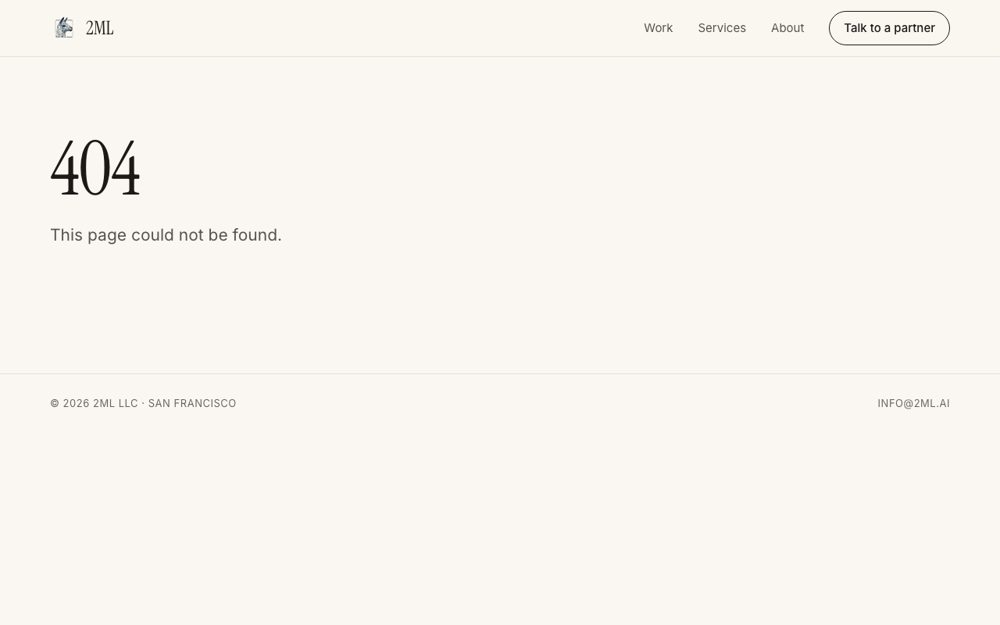
```


